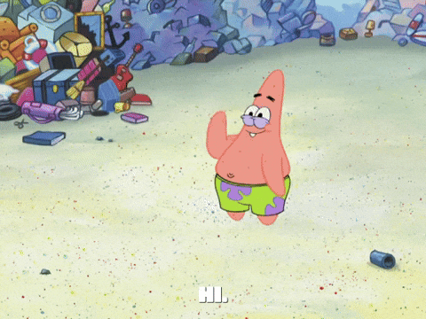

<h1 align="center">Hi There! I'm Chandramouli Baskaran </h1>  
<h3 align="center">Software Developer</h3>

## About Me
- I build, ship, and tell the story in public.
- Grew NextWorks social media to 250K+ followers in one year.
- Help teach 145,000+ students cloud, AI, and tech skills

## 🧰 My Toolbox
<!-- Skill icons provided by skill-icons. Full icon list and names:
     https://github.com/tandpfun/skill-icons?tab=readme-ov-file#icons-list -->
### Main Skills

### Cybersecurity ToolBox
 

**Also comfortable with**: SQL (BigQuery, Postgres), CI/CD pipelines, Networking and Security (VPC, IAM), Basic ML workflows.

---

## Projects - showcase

<table>
  <tr>
    <td align="center" width="33%">
      
       
      <b>DeepSeek AI Chatbot</b> 
      Built an LLM-powered chatbot that answers domain-specific questions in real time. 
      🔗 <a href="https://github.com/maximus-soares/Projects/blob/main/AI%20Projects/Deepseek.md">Repo</a>
       
      Tags: AI, LLMs, Prompt Engineering
    </td>
    <td align="center" width="33%">
      
       
      <b>Cloud CI/CD Pipeline</b> 
      Automated deployment of a web app using GitHub Actions and AWS ECS. 
      🔗 <a href="https://github.com/maximus-soares/Projects/blob/main/CICD%20Pipeline/Set%20Up%20a%20Web%20App%20in%20the%20Cloud.md">Repo</a>
       
      Tags: DevOps, Docker, GitHub Actions
    </td>
    <td align="center" width="33%">
      
       
      <b>Secure AWS VPC</b> 
      Designed and deployed a custom VPC with public/private subnets and routing. 
      🔗 <a href="https://github.com/maximus-soares/Projects/blob/main/Networking/1%20Build%20a%20VPC.md">Repo</a>
       
      Tags: Networking, AWS, Security
    </td>
  </tr>
</table>

---

## Stats
<!-- Stats card by anuraghazra/github-readme-stats
     Customization guide:
     - Hide private contributions: &count_private=true|false
     - Theme list: ?theme=gruvbox,radical,tokyonight,onedark,dracula etc.
     - Show icons: &show_icons=true
     Docs: https://github.com/anuraghazra/github-readme-stats -->

---

## Links

- [**Portfolio**](https://learn.nextwork.org/happy_maroon_jolly_red_currant/portfolio)
- [**Contact**](mailto:bcmouli2006@gmail.com)
- [**Resume**](https://drive.google.com/file/d/1jb92oTicUfBztQEmi1TTfmp6aHDNX9hh/view?usp=drive_link)
  

# GitHub Streak

